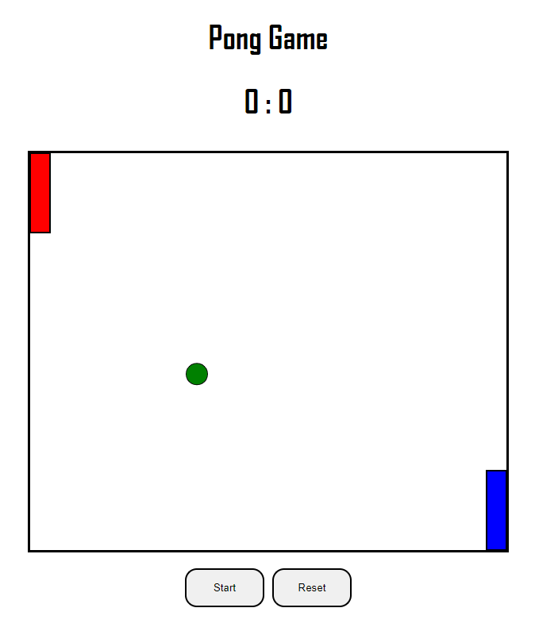

# Pong

A game of Pong written in TypeScript. To play as a left player you have to use keys "w" to go up and "s" 
to go down. To play as right player you have to use Arrow Up and Arrow Down.

# Technology Stack

* TypeScript 4.7.4,
* CSS 3,
* HTML 5.

## ScreenShots

